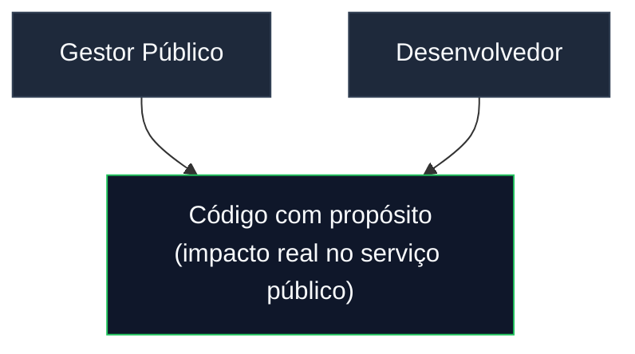
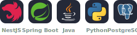
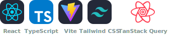
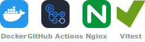

<div align="center">


<br/>

[](https://www.linkedin.com/in/renancastrodev/)
[](https://instagram.com/renancastro.costa)
[](https://github.com/Renancastrocosta)

</div>

---

## Sobre mim

Sou **Renan Castro**, desenvolvedor **Full Stack** em formação, com raízes na **gestão pública** de Mato Grosso. Essa combinação rara — entender processos do setor público e traduzi-los em software bem arquitetado — é o que me diferencia.

Acredito em código **limpo, documentado e testável**. Não construo apenas telas: penso em camadas, contratos de API, CI/CD, Docker e na jornada completa do usuário.



| Traço marcante | Como aparece no meu trabalho |
|----------------|------------------------------|
| **Visão sistêmica** | Arquitetura em camadas, DTOs, separação front/back |
| **Documentação** | READMEs detalhados, diagramas, jornadas de teste |
| **Pragmatismo** | Docker Compose, perfis `local`/`prod`, mocks para demo |
| **Aprendizado contínuo** | Projetos de portfólio baseados em desafios reais |

---

## Stack & Ferramentas

### Backend

<p align="left">
  
</p>

### Frontend

<p align="left">
  
</p>

### DevOps & Qualidade

<p align="left">
  
</p>

---

## Projetos em destaque

### [artistas-fullstack](https://github.com/Renancastrocosta/artistas-fullstack)

> Catálogo full stack de **artistas e álbuns** — API REST + SPA com autenticação JWT, WebSocket em tempo real e upload de capas.

| | |
|---|---|
| **Stack** | Java 21 · Spring Boot 3 · React 19 · TypeScript · PostgreSQL · MinIO |
| **Destaques** | JWT + refresh token · STOMP/SockJS · URLs pré-assinadas S3 · Rate limit (Bucket4j) · Flyway · CI/CD + deploy SSH |
| **Padrões** | Camadas (web → service → repository) · Facade no front · RxJS `BehaviorSubject` · Lazy loading de rotas |

```bash
docker compose up --build   # stack completo: API + SPA + Postgres + MinIO
```

---

### [React-Enterprise-Starter](https://github.com/Renancastrocosta/React-Enterprise-Starter)

> Template de portfólio que demonstra **padrões frontend corporativos** em React — arquitetura por features, server state e design system.

| | |
|---|---|
| **Stack** | React 19 · TypeScript · TanStack Query 5 · shadcn/ui · Tailwind 4 · Zod |
| **Destaques** | Guards por permissão · Mock API offline · Interceptor 401 · AlertDialog · Vitest + GitHub Actions |
| **Padrões** | `services` → `queries` → `mutations` → `features` · Context API auth · Formulários tipados RHF + Zod |

```bash
npm install && npm run dev   # demo em http://localhost:5173
```

---

## GitHub Stats

<div align="center">


</div>

---

## Contato

Estou aberto a colaborações, oportunidades e conversas sobre tecnologia aplicada ao setor público.

<div align="center">

| Canal | Link |
|-------|------|
| **LinkedIn** | [linkedin.com/in/renancastrodev](https://www.linkedin.com/in/renancastrodev/) |
| **Instagram** | [@renancastro.costa](https://instagram.com/renancastro.costa) |
| **GitHub** | [@Renancastrocosta](https://github.com/Renancastrocosta) |
| **Localização** | Cuiabá-MT, Brasil |

</div>

---

<div align="center">

*"Da gestão pública ao código — construindo soluções que fazem sentido."*


</div>
